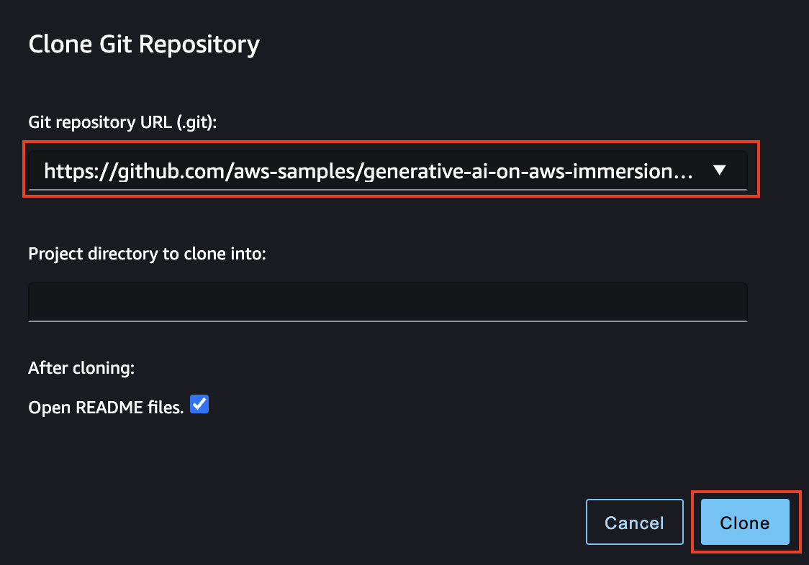

# Generative AI Immersion Day

For conducting the labs, some basic account setup steps are required. They are described subsequently in what follows.

# Setup

## AWS-hosted event

### Event Engine AWS Account access

Go to: https://dashboard.eventengine.run/login . You will be redirected to the page below.


Enter the event hash you have received from your instructor.


Click on Email One-Time Password (OTP).


You are redirected to the following page:


Enter your email address and click on Send passcode.


You are redirected to the following page:


Check your mailbox, copy-paste the one-time password and click on Sign in.

You are redirected to the Team Dashboard. Click on AWS Console.


On the next screen, click on Open Console.


You are then redirected to the AWS Console.

Amazon SageMaker Studio Access: Amazon SageMaker Studio is a web-based, integrated development environment (IDE) for machine learning that lets you build, train, debug, deploy, and monitor your machine learning models. Studio provides all the tools you need to take your models from experimentation to production while boosting your productivity.

If the AWS Account has been provisioned by your AWS Instructor, follow the next steps to access the SageMaker Studio environment:

Open AWS console and switch to AWS region communicated by your instructor.

You can find the list of the AWS regions that support SageMaker Studio [here](https://docs.aws.amazon.com/sagemaker/latest/dg/studio.html).


Under services search for Amazon SageMaker.


Under Getting Started, click on Studio.


A SageMaker Studio environment should already be provisioned. Under Get Started, Click on the orange button Open Studio (a user profile "sagemakeruser" is already selected)


The page can take 1 or 2 minutes to load when you access SageMaker Studio for the first time.


You will be redirected to a new web tab that looks like the below figure. Click Open Launcher.


Under Notebooks and compute resources, make sure that the Data Science SageMaker image and Kernel Python 3 is selected. Click Create notebook.


You will land in the Untitled.ipynb notebook.


You can rename the notebook by right clicking on the name.


Congratulations!! You have successfully launched a SageMaker Studio Notebook and are now familiar with the basic flow within Sagemaker Studio. You will not need this specific notebook for the upcoming labs, however you can use the exact same notebook configuration (instance, image) throughout the upcoming labs.

# Downloading the content of the GitHub repository needed for the labs

## Clone Repository

In the SageMaker Studio menu bar, click on Git and then on the Clone Git Repository option.


In the Git repository URL, enter the repository below and click Clone.
```
https://github.com/aws-samples/generative-ai-on-aws-immersion-day.git
```


After completion you will have the generative-ai-immersion-day folder created in the left panel of the studio:


Congratulations!! You have successfully downloaded the content of the Generative AI Immersion Day. From now on you can start working on the labs!

# Labs

**Lab 1** - Hosting Large Language Models can be found in the lab1 directory. Start with the notebook **gpt-j-notebook-full.ipynb**.

**Lab 2** - Finetuning Large Language Models can be found in the lab2 directory. Start with the notebook **fine-tuning.ipynb**.

## Notebook configuration
When launching the notebook, make sure the Data Science image and the Python 3 Kernel is selected, then click on "Select".

